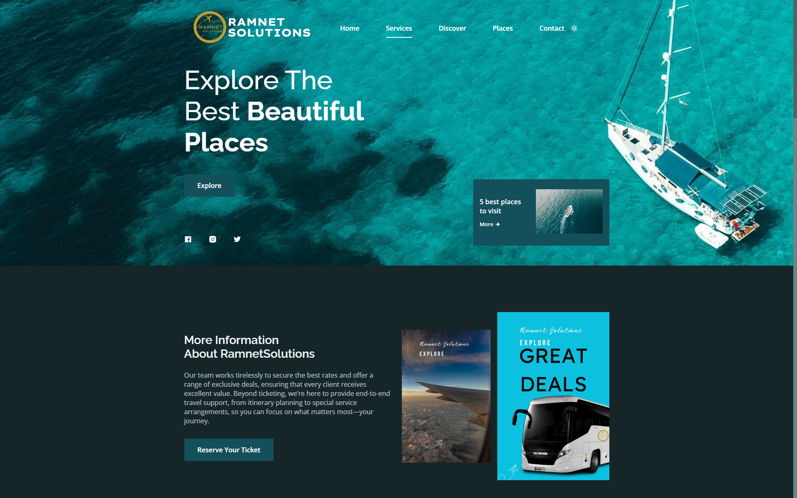
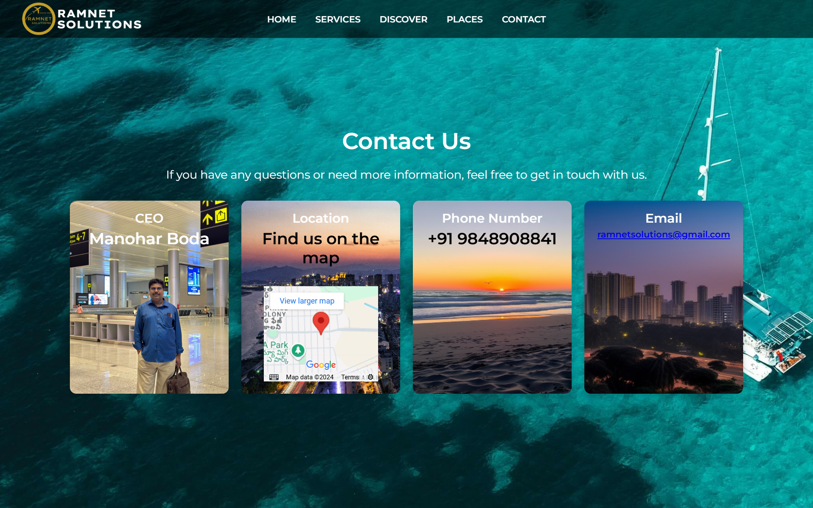

# 🌍 RamnetSolutions - Travel Agency Website  

Welcome to **RamnetSolutions**, a modern and user-friendly travel agency website designed to help users explore and book their dream destinations effortlessly.  

## 🚀 Features  

- **Responsive Design**: Fully responsive layout for an optimal user experience on all devices.  
- **Dynamic Navigation**: Intuitive menu button and interactive navigation bar.  
- **Visually Appealing**: Elegant design showcasing travel destinations, packages, and services.  
- **User-Friendly Interface**: Easy-to-use forms for inquiries and bookings.  

## 🛠️ Technologies Used  

- **Frontend**: HTML, CSS, JavaScript    
- **Additional Tools**:  
  - **Version Control**: Git & GitHub  
  - **Frameworks/Libraries**: (List if any, e.g., Bootstrap, jQuery)  

## 📸 Screenshots  
**Homepage**  
  

**Services Page**  
  

**Contact us page**  


## 🌟 How to Use  

1. Clone the repository:  
   ```bash  
   git clone [https://github.com/Ramnetsolutions/RamnetSolutions.git](https://github.com/RamnetSolutions/Ramnetsolutions)  
   cd RamnetSolutions  
   ```  
2. Open the project folder and run it on your favorite browser.  

## 🛤️ Future Improvements  

- Add online booking functionality.  
- Integrate user reviews and testimonials.  
- Implement a real-time chat support feature.  
- Optimize for better performance and SEO.  

## 💻 Deployment  

The project is deployed and accessible at: [https://ramnetsolutions.github.io/Ramnetsolutions/index.html#home](https://ramnetsolutions.github.io/Ramnetsolutions/index.html#home)  

## 🤝 Contributing  

Contributions are always welcome! Here's how you can help:  

1. Fork the repository.  
2. Create a new branch (`git checkout -b feature/YourFeature`).  
3. Commit your changes (`git commit -m 'Add your message'`).  
4. Push to the branch (`git push origin feature/YourFeature`).  
5. Open a Pull Request.  

## 📝 License  

This project is licensed under the [MIT License](LICENSE).  

## 🌐 Connect  

- **Website**: [RamnetSolutions](https://ramnetsolutions.github.io/Ramnetsolutions/index.html#home)  
- **Email**: [manikantaboda07@gmail.com](mailto:manikantaboda07@gmail.com)  
- **GitHub**: [Ramnetsolutions](https://github.com/Ramnetsolutions)  
